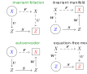

# Invariant Models

This package is an improved version of [FMA](https://github.com/rs1909/FMA). Current capabilities are
* Identifies **invariant foliations** in autonomous, periodic and quasi-periodic systems from **data**.
* Calculates invariant manifolds in autonomous, periodic and quasi-periodic systems from discrete-time systems and vector fields.
* Calculates invariant foliations in autonomous, periodic and quasi-periodic systems from discrete-time systems and vector fields.
* Calculates instantaneous frequencies and damping ratios on two-dimensional invariant manifolds.

## Background

The system in question is assumed to obey the discrete-time map
```math
\begin{aligned}
\boldsymbol{x}_{k+1} &=\boldsymbol{F}\left(\boldsymbol{x}_{k},\boldsymbol{\theta}_{k}\right)\\\boldsymbol{\theta}_{k+1} &= \boldsymbol{\theta}_{k}+\boldsymbol{\omega} \Delta t,
\end{aligned} \tag{MAP}
```
where it is assumed that ``\Delta t`` is the sampling period, that is the duration of time between two samples ``\boldsymbol{x}_k`` and ``\boldsymbol{x}_{k+1}``.
or the vector field
```math
\begin{aligned}
\dot{\boldsymbol{x}} &=\boldsymbol{F}\left(\boldsymbol{x},\boldsymbol{\theta}\right)\\\dot{\boldsymbol{\theta}} &= \boldsymbol{\omega},
\end{aligned}  \tag{ODE}
```
It may be the case that variable ``\boldsymbol{\theta}`` is absent and therefore the system is autonomous.

## Invariance

There are four ways to connect a low-order model ``\boldsymbol{R}`` to ``\boldsymbol{F}``. The figure below shows the four combinations. Only invariant foliations and invariant manifolds produce meaningful reduced order models. Only invariant foliations and autoencoders can be fitted to data. The intersection is invariant foliations. 



Therefore, 
* when a **system of equations** is given, invariant manifolds are the most appropriate (foliations are still possible),
* when **data** is given, only invariant foliations are appropriate.

Autoencoders such as [SSMLearn](https://github.com/haller-group/SSMLearn) do not enforce invariance and therefore generate spurious results as shown in **[Data-Driven Reduced Order Models Using Invariant Foliations, Manifolds and Autoencoders](https://doi.org/10.1007/s00332-023-09932-y)**.

### Invariant Foliations

The invariance equation for foliations is
```math
\boldsymbol{R}\left(\boldsymbol{U}\left(\boldsymbol{x},\boldsymbol{\theta}\right),\boldsymbol{\theta}\right) = \boldsymbol{U}\left(\boldsymbol{F}\left(\boldsymbol{x},\boldsymbol{\theta}\right),\boldsymbol{\theta}+\boldsymbol{\omega}\right) \tag{FOIL}
```

### Invariant Manifolds

The invariance equation for manifolds is
```math
\boldsymbol{S}\left(\boldsymbol{V}\left(\boldsymbol{x},\boldsymbol{\theta}\right),\boldsymbol{\theta}\right) = \boldsymbol{V}\left(\boldsymbol{F}\left(\boldsymbol{x},\boldsymbol{\theta}\right),\boldsymbol{\theta}+\boldsymbol{\omega}\right) \tag{MAN}
```

## Case Study of a Minimal Forced System

We consider a forced version of the Shaw-Pierre example, that originally appeared in [].
```math
\begin{aligned}
    \dot{x}_1 &= x_3 \\
    \dot{x}_2 &= x_4 \\
    \dot{x}_3 &= - c x_3 - k x_1 - \kappa y_1^3 + k (x_2 - x_1) + c (x_4 - x_3) + p \cos(\theta+0.1) \\
    \dot{x}_4 &= - c x_4 - k x_2 - k (x_2 - x_1) - c (x_4 - x_3) + p \cos(\theta) \\
    \dot{\theta} &= \omega \\
\end{aligned}
```
The parameters are ``k=1``, ``\kappa = 0.2``, ``c = 2^{-5}``. The forcing frequency is ``\omega = 1.2`` and the the forcing amplitude is ``p=0.25``.

Without forcing the natural frequencies are approximately ``\omega_1 = 1``, ``\omega_2 = \sqrt{3}``. The damping ratios are ``\zeta_1 = 0.01561`` and ``\zeta_2 = 0.02705``. The spectral quotient for the first mode is ``\beth_1 = 3`` and for the second mode is ``\beth_2 = 1``. When forcing is turned on these values change slightly due to nonlinearity.

### Set-up

```@setup full
push!(LOAD_PATH, pwd() * "/../../")
```
First we import the required packages
```@example full
using InvariantModels
using GLMakie
using CairoMakie # hide
GLMakie.activate!() # hide
```

Consider the Shaw-Pierre vector field
```@example full
NDIM = 4

function shawpierre!(x, y, p, t)
    k = 1.0
    kappa = 0.2
    c = 2^-5

    x[1] = y[3]
    x[2] = y[4]
    x[3] = - c*y[3] - k*y[1] - kappa*y[1]^3 + k*(y[2]-y[1]) + c*(y[4]-y[3]) + p * cos(t+0.1)
    x[4] = - c*y[4] - k*y[2] - k*(y[2]-y[1]) - c*(y[4]-y[3]) + p * cos(t)
    return x
end

function shawpierre(z, p, t)
    dz = zero(z)
    return shawpierre!(dz, z, p, t)
end
```
Set up some system parameters
```@example full
Amplitude = 0.25        # forcing amplitude
omega_ode = 1.2         # forcing frequency

# parameters of the numerical method
fourier_order = 7       # fourier harmonics to be resolved
ODE_order = 7           # polynomial order of the calculations
SEL = [1 2]             # which invariant vector bundle to use
dispMaxAmp = 1.0        # maximum amplitude to display

```

### Invariant Manifolds of Vector Fields

Create a polynomial `MPode`, `XPode` out of our vector field
```@example full
MPode = QPPolynomial(NDIM, NDIM, fourier_order, 0, ODE_order)
XPode = fromFunction(MPode, (x, t) -> shawpierre(x, Amplitude, t))

```
The invariant manifold can now be calculated using [`QPODETorusManifold`](@ref):
```@example full
MK, XK, MSn, XSn, MWn, XWn, _, _, _, _, XWre, oeva = QPODETorusManifold(MPode, XPode, omega_ode, SEL, threshold=0.1, resonance=false)

```
The frequencies and damping ratios are extracted from the reduced order model using [`ODEFrequencyDamping`](@ref)
```@example full
That_ode, Rhat_ode, rho_ode, gamma_ode = ODEFrequencyDamping(MWn, XWn, MSn, XSn, dispMaxAmp)
odeAmp = range(0, dispMaxAmp, length=1000)
odeFreq = abs.(That_ode.(odeAmp))
odeDamp = -Rhat_ode.(odeAmp) ./ odeFreq

```
The results are then plotted
```@example full
fig = Figure(size=(1200, 400))
axFreq = Axis(fig[1, 3])
axDamp = Axis(fig[1, 4])
axFreq.xlabel = "Frequency"
axFreq.ylabel = "Amplitude"
axDamp.xlabel = "Damping ratio"
axDamp.ylabel = "Amplitude"

lines!(axFreq, odeFreq, odeAmp, label="ODE O($(ODE_order)) A=$(Amplitude)", linestyle=:dash, linewidth=2)
lines!(axDamp, odeDamp, odeAmp, label="ODE O($(ODE_order)) A=$(Amplitude)", linestyle=:dash, linewidth=2)
display(fig)
CairoMakie.activate!(type="svg") # hide
save("fig-data-ODE.svg", fig) # hide
GLMakie.activate!() # hide
```


### Invariant Manifolds of Maps

First we set up some additional parameters, such as the sampling period ``\Delta t`` = `Tstep`
```@example full
Tstep = 0.8                 # sampling period
omega = omega_ode * Tstep   # shift angle
```
We now create a discrete-time map from the vector field by Taylor expanding an ODE solver about the origin using [`mapFromODE`](@ref). We take 500 time steps on the interval ``[\theta,\theta + \Delta t]``. The resulting map `MP`, `XPmap` is dependent on the phase variable ``\theta \in [0,2\pi)``
```@example full
MP = QPPolynomial(NDIM, NDIM, fourier_order, 0, ODE_order)
XPmap = zero(MP)
mapFromODE(MP, XPmap, shawpierre!, Amplitude, omega_ode, Tstep / 500, Tstep)

```
The invariant manifold of the map is calculated using [`QPMAPTorusManifold`](@ref)
```@example full
MK, XK, MSn, XSn, MWn, XWn, MSd, XSd = QPMAPTorusManifold(MP, XPmap, omega, SEL, threshold = 0.1, resonance = false)

```
The frequencies and damping ratios are extracted from the reduced order model using [`MAPFrequencyDamping`](@ref)
```@example full
That, Rhat_r, rho, gamma = MAPFrequencyDamping(MWn, XWn, MSn, XSn, dispMaxAmp)
mapAmp = range(0, dispMaxAmp, length=1000)
mapFreq = abs.(That.(mapAmp)) ./ Tstep
mapDamp = -log.(abs.(Rhat_r.(mapAmp))) ./ abs.(That.(mapAmp))

```
The results are plotted
```@example full
lines!(axFreq, mapFreq, mapAmp, label="MAP O($(ODE_order)) A=$(Amplitude)", linestyle=:dashdot, linewidth=2)
lines!(axDamp, mapDamp, mapAmp, label="MAP O($(ODE_order)) A=$(Amplitude)", linestyle=:dashdot, linewidth=2)
display(fig)
CairoMakie.activate!(type="svg") # hide
save("fig-data-MAP.svg", fig) # hide
GLMakie.activate!() # hide
```


### Invariant Foliations of Maps

Using [`QPGraphStyleFoliations`](@ref), two invariant foliations are calculated and the invariant manifold defined by the zero level-set of the second foliation is extracted.
```@example full
MRf, XRf, MW, XW, MRt, XRt, MUt, XUt, MSt, XSt, MVt, XVt = QPGraphStyleFoliations(MP, XPmap, omega, SEL; dataScale=1, resonance=false, threshold=0.1)

```
The results are plotted
```@example full
That, Rhat_r, rho, gamma = MAPFrequencyDamping(MW, XW, MRf, XRf, dispMaxAmp)
foilAmp = range(0, dispMaxAmp, length=1000)
foilFreq = abs.(That.(foilAmp)) ./ Tstep
foilDamp = -log.(abs.(Rhat_r.(foilAmp))) ./ abs.(That.(foilAmp))

lines!(axFreq, foilFreq, foilAmp, label="FOIL O($(ODE_order)) A=$(Amplitude)", linestyle=:dashdot, linewidth=2)
lines!(axDamp, foilDamp, foilAmp, label="FOIL O($(ODE_order)) A=$(Amplitude)", linestyle=:dashdot, linewidth=2)
display(fig)
CairoMakie.activate!(type="svg") # hide
save("fig-data-FOIL.svg", fig) # hide
GLMakie.activate!() # hide
```


## ROM identification from data

### Set-up

Importing a library to load/store data and specifying parameters
```@example full
using BSON: @load, @save
# parameters for the data-driven part
maxSimAmp = 1.0     # maximum initial condition measured from the torus
maxAmp = 1.0        # filter out data with amplitude greater than maxAmp
dataRatio = 1.0     # the proportion of data to be retained when filtering (all of it)
R_order = 7         # polynomial order of R
U_order = 7         # polynomial order of U
V_order = 7         # polynomial order of V
S_order = 7         # polynomial order of S
STEPS = 800         # number of optimisation steps to use

# the names of data files
revision = "shawpierre-2p$(log2(scale_epsilon))-SIMAMP$(maxSimAmp)-AMP$(Amplitude)-F$(fourier_order)-R$(R_order)-U$(U_order)-V$(V_order)-S$(S_order)-MODE$(SEL[1])"
datarevision = "shawpierre-SIMAMP$(maxSimAmp)-AMP$(Amplitude)-F$(fourier_order)"
```

### Creating data

We create 600 trajectories 60 points long each using [`generate`](@ref) and save the data for future use.
```@example full
dataX, dataY, thetaX, thetaY, thetaNIX, thetaNIY = generate(NDIM, shawpierre!, ones(NDIM) * maxSimAmp, 600, 50, fourier_order, omega_ode, Tstep, Amplitude, XWre)
@load "data-$(datarevision).bson" dataX dataY thetaX thetaY Tstep # hide

```

### Finding an Approximate Linear Model

An approximate linear model is found about the invariant torus using [`findLinearModel`](@ref).
```@example full
A, b, MK1, XK1 = findLinearModel(dataX, thetaX, dataY, thetaY, omega)

```

### Identifying Invariant Vector Bundles and Transforming Data

We calculate invariant vector bundles from the linear model and project the data into this coordinate system using [`QPPreProcess`](@ref)
```@example full
thetaTX, dataTX, thetaTY, dataTY, dataScale, preId, R1, S1, W1 = QPPreProcess(XK1, A, omega, thetaX, dataX, thetaY, dataY, SEL; Tstep=Tstep, maxAmp=maxAmp, data_ratio=dataRatio)

```
Here, the inverse transformation `W1` was also created.

### Setting up the Function Approximators

We create the data structure holding our two invariant foliations using [`QPCombinedFoliation`](@ref) and set up the data cache that speeds up calculations using [`makeCache`](@ref). Our optimisation algorithm requires setting up so-called trust-region `radii`. For housekeeping purposes we also specify using `dataIdV` that all data points are used for identifiction.
```@example full
MCF, XCF = QPCombinedFoliation(NDIM, 2, fourier_order, R_order, U_order, S_order, V_order, R1, S1, MK1, zero(XK1), sparse=false)
# creating a cache
XCFcache = makeCache(MCF, XCF, thetaTX, dataTX, thetaTY, dataTY)
dataIdV = Array{Any,1}(undef, 1)
dataIdV[1] = 1:size(thetaTX, 2)
radii = to_zero(XCF)

```

### Performing the Optimisation

Using function [`QPOptimise`](@ref), the optimal parameter values of our foliation are found:
```julia
QPOptimise(MCF, XCF, thetaTX, dataTX, thetaTY, dataTY;
        maxit=8, gradient_ratio=2^(-7), gradient_stop=2^(-29), steps=STEPS, name=revision,
        cache=XCFcache,
        omega=omega, Tstep=Tstep, dataId=dataIdV[1], radii=radii)
```

### Analysis of the result

The post processing step using [`QPPostProcess`](@ref) extract a reduced order model together with an invariant manifold. The manifold immersion ``\boldsymbol{W}`` is `MW`, `XW`.
```@example full
@load "CF-$(revision).bson" MCF XCF Tstep dataId dataScale # hide
MSn, XSn, MFW, XFWoWdoWn, MW, XW = QPPostProcess(MCF, XCF, W1, omega)

```

The instantaneous frequencies and damping ratios are also plotted
```@example full
That, Rhat_r, rho, gamma = MAPFrequencyDamping(MFW, XFWoWdoWn, MSn, XSn, dispMaxAmp / dataScale)
r_data = range(0, dispMaxAmp / dataScale, length=1000)
dataFreq = abs.(That.(r_data)) / Tstep
dataDamp = -log.(abs.(Rhat_r.(r_data))) ./ abs.(That.(r_data))
dataAmp = r_data .* dataScale
# plotting
lines!(axFreq, dataFreq, dataAmp, label="DATA O($(R_order), $(S_order))", linestyle=:solid, linewidth=2)
lines!(axDamp, dataDamp, dataAmp, label="DATA O($(R_order), $(S_order))", linestyle=:solid, linewidth=2)
display(fig)
CairoMakie.activate!(type="svg") # hide
save("fig-data-DATA.svg", fig) # hide
GLMakie.activate!() # hide
```


### Error Analysis

To make sense of the results, we analyse the fitting error, which is the residual of the invariance equation divided by the distance from the invariant torus
```math
    E = \frac{\left| \boldsymbol{R}\left(\boldsymbol{U}\left(\boldsymbol{x}_k,\theta_k\right),\theta_k\right) - \boldsymbol{U}\left(\boldsymbol{y}_k,\theta_k +\omega\right) \right|}{\left| \boldsymbol{x}_k - K(\theta_k) \right|}
```
The amplitude of a given point is calculated by
```math
    A = \left| \boldsymbol{W}(\boldsymbol{U}(\boldsymbol{x}_k, \theta_k)) \right|
```
The following call calculates ``A`` as `OnManifoldAmplitude` and various statistics about `E` as a function of the amplitude.
```@example full
OnManifoldAmplitude, hsU, errMaxX, errMaxY, errMinX, errMinY, errMeanX, errMeanY, errStdX = ErrorStatistics(MCF, XCF, MW, XW, thetaTX, dataTX, thetaTY, dataTY; dataScale=dataScale, cache=XCFcache)
den = Makie.KernelDensity.kde(sort(vcat(OnManifoldAmplitude, -OnManifoldAmplitude)))
atol = eps(maximum(den.density))
den.density[findall(isapprox.(den.density, 0, atol=atol))] .= atol
dataDensityX = den.density
dataDensityY = den.x

```

The error and data distribution is the plotted

```@example full
axErr = Axis(fig[1, 2], xscale=log10)
axDense = Axis(fig[1, 1], xscale=log10)
xlims!(axErr, 1e-6, 1e-1)
ylims!(axErr, 0, maxAmp)
xlims!(axDense, 1e-2, 100)
ylims!(axDense, 0, maxAmp)

lines!(axDense, dataDensityX, dataDensityY)
heatmap!(axErr, hsU, colormap=GLMakie.Reverse(:greys))
lines!(axErr, errMaxX, errMaxY, linestyle=:solid, linewidth=2, color=:red)
lines!(axErr, errMinX, errMinY, linestyle=:solid, linewidth=2, color=:red)
lines!(axErr, errMeanX, errMeanY, linestyle=:dash, linewidth=2, color=:blue)
lines!(axErr, errMeanX .+ errStdX, errMeanY, linestyle=:dot, linewidth=2, color=:green)
```

Finally plot legends are displayed
```@example full
# creating the legend
fig[1, 5] = Legend(fig, axFreq, merge=true, unique=true, labelsize=16, backgroundcolor=(:white, 0), framevisible=false, rowgap=1)
resize_to_layout!(fig)
display(fig)
CairoMakie.activate!(type="svg") # hide
save("fig-data-DATA-ERR.svg", fig) # hide
GLMakie.activate!() # hide
```


## Functional Representation

All data structures follow the conventions of [ManifoldsBase.jl](https://@example fullmanifolds.github.io/ManifoldsBase.jl). For example, the representation of the submersion ``\boldsymbol{U}`` is given as two components `MU` and `XU`, where `MU` describes the function and `XU` contains the parameters of ``\boldsymbol{U}``.

### Interpolation in Fourier Space

When representing periodic functions, we use Fourier collocation. The grid of the collocation is given by
```math
\vartheta_{1}=0,\ldots,\vartheta_{2\ell+1}=\frac{2\ell}{2\ell+1}2\pi,
```
where ``\ell`` is the highest resolved Fourier harmonic. The grid has ``2\ell+1`` nodes, which is the same as the number of Fourier coefficients that can uniquely represent a periodic function on the grid.

Given a set of points on the grid ``\boldsymbol{x}_{j}=\boldsymbol{x}\left(\vartheta_{j}\right)``, we can use an interpolation to reconstruct the periodic function on the interval ``[0,2\pi)`` using
```math
\boldsymbol{x}\left(\theta\right)=\sum_{j=1}^{2\ell+1}\gamma\left(\theta-\vartheta_{j}\right)\boldsymbol{x}_{j},
```
where 
```math 
\gamma\left(\theta\right)=\frac{1}{2\ell+1}\frac{\sin\frac{2\ell+1}{2}\theta}{\sin\frac{1}{2}\theta}.
```
Let us define the matrix ``\boldsymbol{X} = (\boldsymbol{x}_{j}, \ldots, \boldsymbol{x}_{2\ell+1})`` 
and the interpolation vector for a given value of ``\theta`` by
```math
\boldsymbol{t}_\theta = (\gamma\left(\theta-\vartheta_{1}\right), \ldots, \gamma\left(\theta-\vartheta_{2\ell+1}\right))^T,
```
then the function evaluation ``\boldsymbol{x}\left(\theta\right)`` is a matrix-vector product
```math
\boldsymbol{x}\left(\theta\right)= \boldsymbol{X} \boldsymbol{t}_\theta.
```

### Input to Data-driven Methods

We assume that the data is produced by an unknown map ``\boldsymbol{F}``, such that 
```math
\boldsymbol{y}_{k} = \boldsymbol{F}\left(\boldsymbol{x}_{k},\theta_{k}\right).
```
When considering trajectories for some set of consecutive indices we have ``\boldsymbol{x}_{k+1}=\boldsymbol{y}_{k}``. 
The data we analyse is organised into matrices
```math
\begin{aligned}
\boldsymbol{X} &= (\boldsymbol{x}_1,\ldots, \boldsymbol{x}_N) \\
\boldsymbol{Y} &= (\boldsymbol{y}_1,\ldots, \boldsymbol{x}_N) \\
\boldsymbol{\Theta}_x &= (\boldsymbol{t}_{\theta_1},\ldots, \boldsymbol{t}_{\theta_N}) \\
\boldsymbol{\Theta}_y &= (\boldsymbol{t}_{\theta_1+\omega},\ldots, \boldsymbol{t}_{\theta_N + \omega})
\end{aligned}
```
## API Reference

### Finding a Linear Model from Data

```@docs
findLinearModel
```

### Data Structures and Related Functions

```@docs
getgrid
```

```@docs
QPConstant
```

```@docs
QPPolynomial
```

```@docs
fromFunction!
```

```@docs
fromFunction
```

```@docs
Eval
```

```@docs
Eval!
```

```@docs
mapFromODE
```

```@docs
toFourier
```

### Semi-analytic Reduction to Invariant Manifolds

```@docs
QPMAPTorusManifold
```

```@docs
QPODETorusManifold
```

### Manifolds via Invariant Foliations

```@docs
QPGraphStyleFoliations
```

### Frequencies and Damping Ratios

```@docs
MAPFrequencyDamping
```

```@docs
ODEFrequencyDamping
```

### Generating Data

```@docs
generate
```

```@docs
generateMap
```

### Identfying Invariant Foliations from Data

```@docs
QPPreProcess
```

```@docs
QPCombinedFoliation
```

```@docs
makeCache
```

```@docs
updateCache!
```

```@docs
QPOptimise
```

```@docs
QPPostProcess
```

```@docs
EvalU
```

```@docs
EvalV
```

```@docs
Loss
```

```@docs
ResidualU
```

```@docs
ResidualLoss
```

```@docs
QPKernel
```

```@docs
copyMost!
```

```@docs
SetTorus!
```

```@docs
bincuts
```

```@docs
to_zero
```
